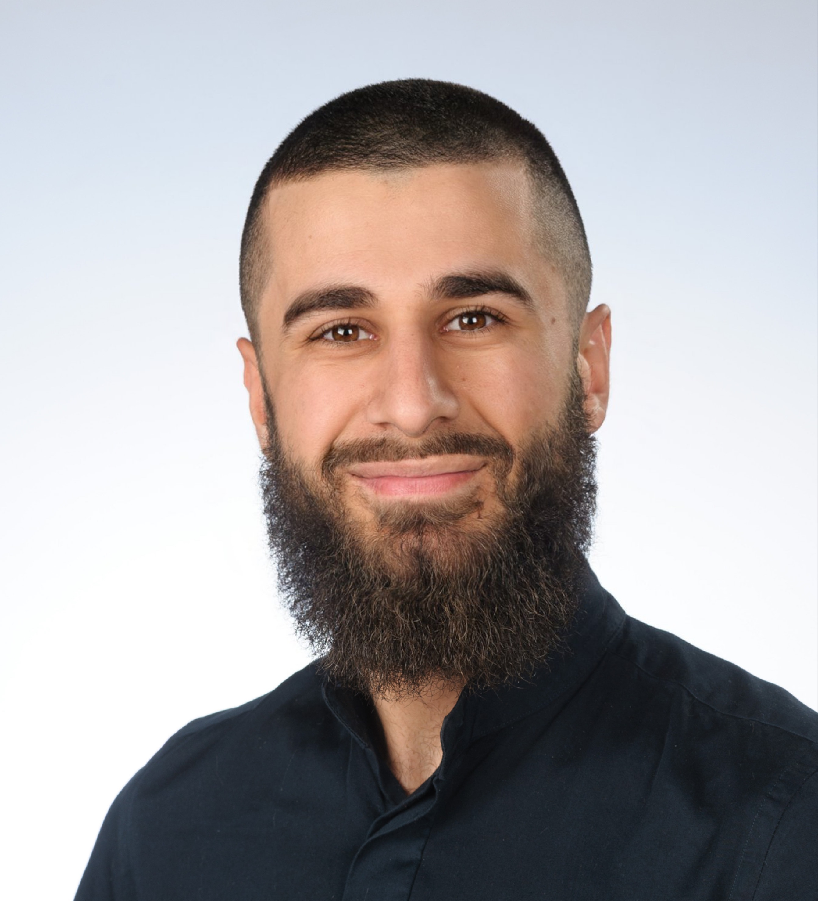

# Wer ist Ferhat Gümüs ?

    <em>
    Das ist Ferhat Gümüs.</em>

## Kurinfos
>- Geb. 28.06.1999 in Bad Hersfeld
>- Wohnort: Espenau
>- Glücklich verheiratet
>- Religion: Islam
>- Abstammunng: kurdisch
>- Das "s" in "Gümüs" wird "sch" ausgesprochen.
---
 ## Zu meiner Person

 Ich bin gut gelaunt, und gehe mit einer Ladung kreativem Chaos durch den Alltag. Mein Glaube gehört fest zu meinem Leben und ist für die meisten, die mich kennen, ein selbstverständlicher Teil von mir. Auch wenn ich damit manchmal ein bisschen aus der Reihe falle, bin ich dankbar, ihn frei leben zu dürfen und dabei auch Unterstützung zu erfahren. Ich hab generell einen hohen Energiepegel, weshalb regelmäßiger Sport in meinem Leben unerlässlich ist. Ich habe manchmal Schwierigkeiten, mich richtig auszudrücken das führt gelegentlich zu Missverständnissen.

---
 ## Karriere

 #### (September 2016) Erster Schritt im Erwachsen werden.
 Nach meinem Realabschluss entschied ich mich die Fachhochschulreife mit dem Schwerpunkt Wirtschaftsinformatik zu erlangen. Gesagt getan 2jahre später hielt ich meinen Abschluss in der Hand. Während dieser Zeit habe ich viel gearbeitet, weil ich Geld haben wollte was ich zum Zeitpunkt nicht gebraucht habe, für materielle Dinge, die ich nicht gebrauchte. Ich war im Imbiss meines Vaters tätig, gleichzeit auch als Servicekraft in Hotels, bei Events und Ähnlichem.
 Während meiner Zeit am Fachabitur verlor ich zunehmend das Interesse an schulischer Bildung. Mein Interesse an Wirtschaft und Informatik jedoch hielt mich fest, sodass ich meinen Abschluss verwirklichen konnte.
 
 #### (Oktober 2018)Das Studium
 Ohne klare Orientierung folgte ich den Fußstapfen meiner Schwester, auf die ich sehr stolz bin, und begann ein Studium im Bereich Berufspädagogik mit dem Schwerpunkt Metalltechnik. 
 
 #### (Oktober 2022) Ich breche das Studium.
 Das Studium löste in mir eine Unruhe aus, also jobbte ich wieder viel für Geld und Dinge, die ich nicht brauchte. ab, da mir schlicht und einfach das Interesse fehlte. 
 Hier begann eine Phase der Umorientierung in meinem Leben. Ich versuchte mich im Vertrieb, in der Hotellerie, in der Logistik und schließlich in der industriellen Fertigung. Auf diesem Weg lernte ich viele Menschen kennen und durfte verschiedene Geschäftsmodelle aus der Nähe betrachten, etwas das ich unglaublich inspirierend finde.

 #### (Januar 2025) Zeit sich zu entscheiden.
 Dennoch wusste ich, dass ich bald eine Entscheidung treffen muss: Was will ich? Und wohin will ich?
 Die Agentur für Arbeit schlug mir eine Umschulung vor. Also schlug ich den Bereich Informatik vor, weil ich erkannt hatte, dass die Themen rund um IT schon immer etwas in mir ausgelöst haben nur fehlte mir damals die Reife, das zu erkennen.
 
 #### (Mai 2025) Andreas ruft an.
 Dank Andreas, der mich anrief, mich doof nannte und damit meine Zukunft rettete, bin ich heute ein dankbarer Teilnehmer bei dem Bildungsträger [CDEMY](https://cdemy.de).

 ---

 ## Was mag ich / treibt mich an

 Mal vom Glauben und Familie abgesehen, liebe ich Sport. 
 Ganz besonders in folgender Reihenfolge:
 
 >1. Boxen
 >2. Muay Thai
 >3. Langstreckenlauf
 >4. Calisthenics (Eigengewichtstraining)
 >5. Die Biochemie hinter dem Sport

 Der Verein in dem ich meine Leidenschaft ausübe -> [LOBOS](https://lobos-kampfsportakademie.de)

Bücher mag ich solange sie Wissen vermitteln. Mit Romanen oder anderen erfundenen Geschichten kann ich hingegen wenig anfangen.

Wenn ich Kopfhörer aufsetze, dann nicht, um **Musik** zu hören, sondern um **Podcasts**, **Hörbücher**, (zielführende) **Debatten**, **Vorträge** oder eine **Rezitation des Qurans** zu hören.

---
## Warum ausgerechnet Anwendungsentwicklung
Ich kann nicht genau sagen, was mich so sehr an der Informatik fasziniert. Es ist vor allem das Interesse daran, wie ein Programm funktioniert, welche Logik dahintersteckt und wie alles aufgebaut ist.
Es ist ein Gefühl in mir, das mir sagt, dass ich in diesem Bereich für die nächste Zeit gut aufgehoben bin. Schon als Kind saß ich oft am Computer und habe mit Hilfe von YouTube Tutorials versucht, bestimmte Einstellungen zu verändern. Ich habe mich immer gefragt, warum der PC eigentlich so funktioniert, wie er funktioniert. Ich hab als Kind zu wenig an die Möglichkeit geglaubt dahinter zu kommen. Das wollen wir heute nachholen.

---
## Kurz gesagt,
Ich musste auf die harte Tour lernen, dass Geld und materieller Besitz keinen echten Wert haben, wenn einem das nötige Wissen fehlt. Heute weiß ich, dass Wissen die Grundlage für alles ist und auch wenn ich das spät erkannt habe, bin ich froh, dass es überhaupt passiert ist. Hier einige Zitate die ich gut finde.

|Zitat|von|
|---|---|
|„Es gibt nichts Erdrückenderes für den Menschen als die Freiheit.“| Fjodor Dostojewski|
|„Du wirst nie wirklich frei, solange du dich nicht selbst kontrollierst.“| Ibn Al-Qayyim |
|„Es ist besser, ein eckiges Etwas zu sein als ein rundes Nichts.“|Theodor Fontane | 
|„Wissen ist besser als Geld. Geld musst du beschützen, während Wissen dich beschützt. Geld nimmt ab wenn du es ausgibst, Wissen vermehrt sich. Wissen ist der Richter während Geld beurteilt wird. Die, die Geld anhäufen sind im Herzen tot, obwohl sie leben. Doch die Gelehrten leben ewig druch die Zeit auch wenn sie selbst nichtmehr unter uns sind, denn ihre Lehren bleiben in den Herzen“(Sinngemäß übersetzt)| Ali ibn abi Talib | 
| „Wenn Gott nicht existiert, ist alles erlaubt.“ | Fjodor Dostojewski|
|„Der Mensch will nicht nur Glück, sondern auch Leid um zu beweisen, dass er ein Mensch ist und kein Klavier.“| Fjodor Dostojewski|
|„Der Beste unter euch ist derjenige, der lernt und das Gelernte weitergibt.“(Sinngemäß)| Muhammad صلى الله عليه وسلم|
|„Vertraue auf Allah aber binde erst dein Kamel fest.“(Sinngemäß)| Muhammad صلى الله عليه وسلم|  

 

